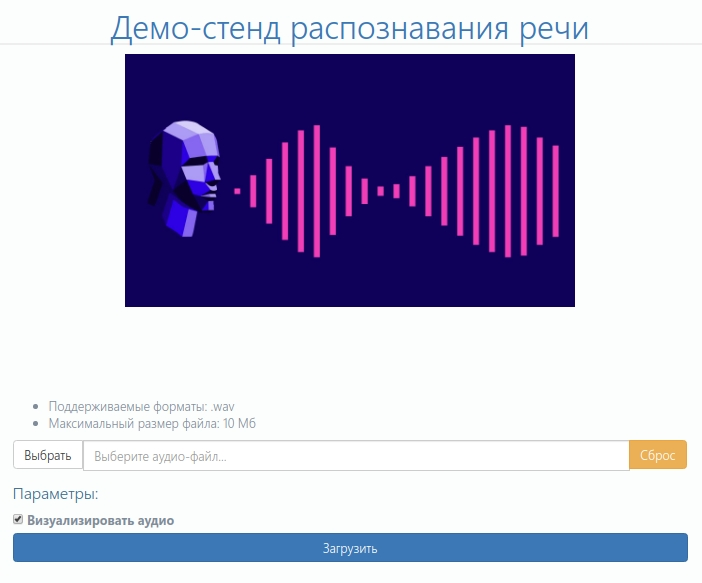
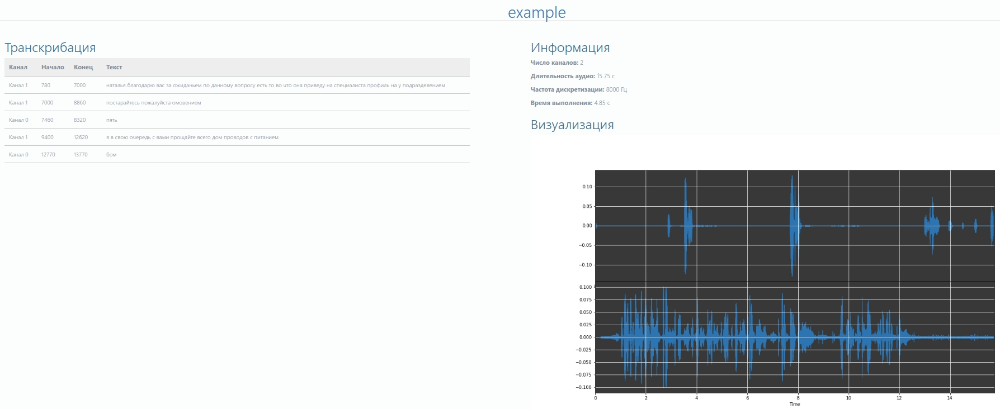

# Демо-стенд распознавания речи

Веб-приложение, написанное с использованием библиотеки flask.

## Структура приложения

Файлы приложения расположены в директории /speech_recognition/web:

* **/data** - директория хранения временных файлов распознавания;
* **/static** - директория для статических файлов:
    * **/css** - каскадные таблицы стилей;
    * **/images** - изображения;
    * **/js** - JavaScript-файлы;
* **/templates** - директория для шаблонов;
* **app.py** - скрипт запуска веб-приложения.

## Запуск

1. Запустить веб-сервер:

`$ ./app.py`

2. Перейти по адресу:

`http://0.0.0.0:5000`

Главная страница:

3. Выбрать WAV-файл, активировать нужные параметры и нажать "Загрузить". 

Результат распознавания:

